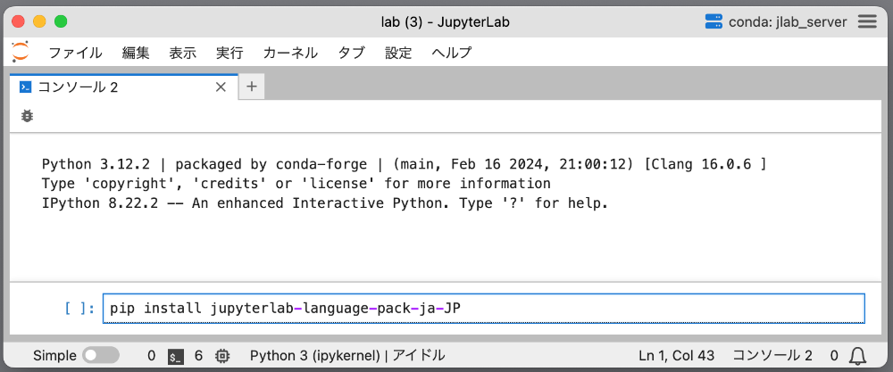
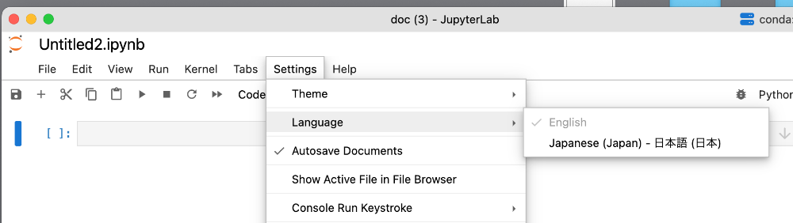
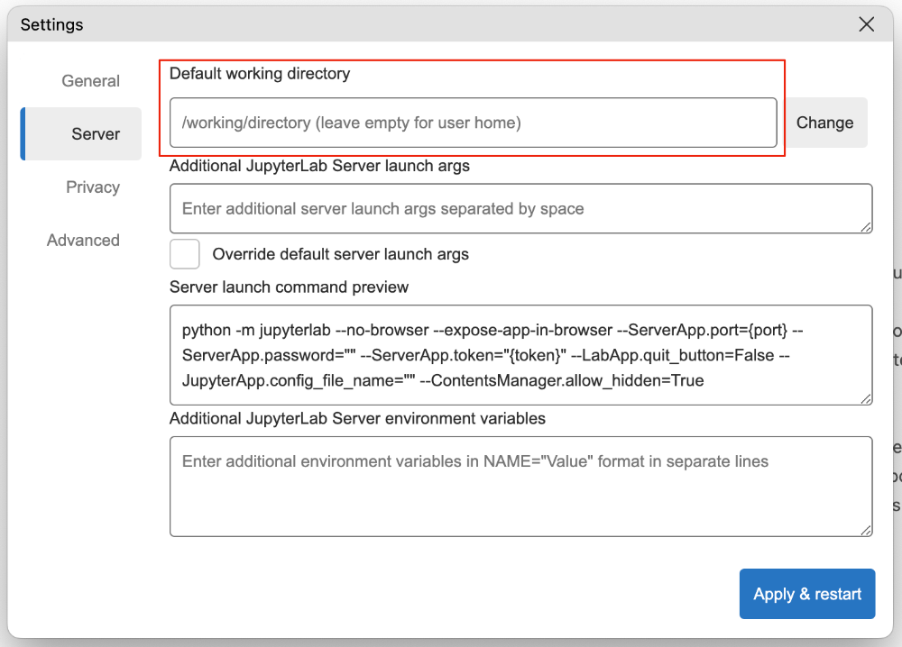
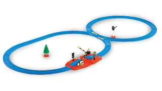

# Python基礎A
## 講義内容
### JupyterLabの使い方(Notobookとコンソール)
- [JupyterLabDesktop](https://github.com/jupyterlab/jupyterlab-desktop "Download") 

#### 日本語化
コンソールの入力欄にpip install jupyterlab-language-pack-ja-JPと入力し、実行(SHIFT+RETURN)。  
日本語ランゲージパックがインストールされます。  
インストール後「Change and relaod」ボタンをクリック。  
Settingsメニュー>LanguageにJapanese(Japan)- 日本語(日本)が追加されます。  



#### 作業ディレクトリの設定
右上のハンバーガーメニューのSettings>ServerにDefault Working Directoryの項目があります。  
設定したいディレクトリ(フォルダ)へのPathを入力することでデフォルトの作業ディレクトリを変更出来ます。  



### データ型 

| データ型 | 解説 | 例 |
| ---------------- | ---------------- | ---------------- |
| str(ストラ) | 文字列 | "創造社デザイン専門学校" |
| int(イント) | 小数点を含まなない数値 | 1967 |
| float(フロート) | 小数点を含む数値 | 25.6 |
| bool(ブール) | 真偽値 |True or False | 
```
# データ型を調べるtype関数
print(type("Python"))
print(type(100))
print(type(0.1))
print(type(True))
```

### 変数
    
```
    num = 1
    print(num)
```  
* 変数名のルール  
    - 小文字のアルファベットとアンダースコアを組み合わせる  
    - 数字で始まらない  
    - 複数の単語から成る場合はアンダースコアで区切る(スネークケース)  

### 算術演算子

| 演算子 | 意味 | 例 |
| ---------------- | ---------------- | ---------------- |
| + | 足し算(加算) | 100 + 50 |
| - | 引き算(減算) | 100 - 50 |
| * | 掛け算(乗算) | 100 * 50 |
| / | 割り算(除算) | 100 / 50 | 
| // | 割り算(整数除算) | 100 // 50 | 
| % | 余り算(剰余) | 100 % 50 | 
| ** | べき乗 | 100 ** 2 | 


### コメント  
\# 行末までコメント  
""" ~ """複数行コメント
### print関数、input関数、open関数

```
# print関数(画面に出力)  
print("Python")
# input関数(キーボードから入力)
data = input("お名前を入力してください>>\n")
# open関数(ファイルを開く)
with open("data.txt","w",encoding="utf-8") as f:
    f.write("Python")
```   

### コレクション
#### リスト
複数のデータを要素としてまとめて取り扱う  
```
# リストを定義
numbers = [0, 10, 20, 30, 40, 50]
# リストのデータ型を確認
type(numbers)

# 文字列を要素とするリストを定義
fruits = ['apple', 'banana', 'chelly']

# indexはゼロから始まる
fruits[0]

# 要素のスライス
abcd = ['a', 'b', 'c', 'd']
abcd[1:3]
```

#### リスト関数
```
# 要素数を数える
len(numbers)

# 最大値
max(numbers)

# 最小値
min(numbers)

# 合計(要素がintやfloatの場合)
sum(numbers)

# 並べ替え(sort と sorted)

# 新しい要素を末尾に追加
fruits.append('grape')

# リストにリストを追加
fruits.extend(['orange','berry'])

# リストに要素を挿入
fruits.insert(2,'pineapple')

# 要素を指定して削除
fruits.remove('orange')

# indexを指定して削除(indexを省略すると末尾)
fruits.pop(3)

# リストのコピー
new_fruits = fruits.copy()
new_fruits
```

#### タプル
タプルは、リストと同じように複数のデータを取り扱うコレクション。
ただし、一度設定した要素を変更できません。
```
subjects = ("ICT・マーケティング","モノ・コトづくり学科")
subjects[0]

```
#### 辞書(ディクショナリ)
辞書は、キー (key) と値 (value) を対応づけるデータです。 
```
# 辞書を定義
scores = {'english':76, 'math':66, 'japanese':70, 'biology':58, 'geography':80}

# 要素を取得
scores['japanese']
scores.get('japanese')

# 要素を変更
scores['math'] = 76

# 要素を追加
scores['music'] = 80

# 要素を削除
del scores['biology']
```

#### 辞書関数
```
# 全削除
scores.clear()

# 値の一覧をリストで取得
scores.values()

# キーの一覧をリストで取得
scores.keys()
```
#### 2次元リスト
```
[
    [99, 27, 31, 53, 79, 45, 36, 80, 88, 17], 
    [83, 69, 72, 5, 50, 76, 11, 26, 10, 40], 
    [28, 94, 40, 77, 6, 43, 85, 82, 36, 43], 
    [69, 52, 45, 59, 75, 61, 31, 25, 45, 7], 
    [2, 76, 65, 29, 82, 58, 64, 52, 99, 61],
]
```

### 条件分岐と繰り返し

#### 比較演算子
| 演算子 | 意味 | 備考 |
| ---------------- | ---------------- | ---------------- |
| a < b | a は b より小さい |  |
| a <= b | a は b と等しいか小さい |  |
| a > b | a は b より大きい |  |
| a >= b | a は b と等しいか大きい |  | 
| a == b | a と b は等しい |  | 
| a != b | a と b は等しくない |  | 

#### 条件
```
#比較演算子の計算結果(条件)はbool型
print(100 > 80)
```
Falseとみなされる値  
- 0 (int型)  
- 0.0 (float型)  
- "" (空のstr型)  
- [] (要素を持たないlist型)  
- {} (キーも値も持たないdict型)  
- () (要素を持たないタプルやセット)  

Noneかどうかを判断する
- is None (Noneの時にTrue)
- is not None (Noneの時にFalse)

#### 条件分岐
条件により処理を選択する  

```
# 条件がTrueになる場合、インデント内の処理を実行する
a = 80
if a < 100:
    print('変数a は 100より小さい値です')

```
Pythonではブロックの代用としてインデントを使用する
if 条件:に続く行はインデントを適切に設定し、条件に当てはまる時に実行される処理を記述する。  
注)インデント内に何も記述がないとIndentErrorが発生する。処理が未確定の時はpassと記述する。

```
# 条件がTrueになる場合、インデント内の処理を実行する。
# Falseの場合はelse:に続くインデント内の処理を実行する。
a = 80
if a < 100:
    print('変数a は 100より小さい値です')
else:
    print('変数a は 100より大きい値です')

# elif文で条件を更に追加出来る。
# 上の条件に当てはまらないが、次の条件にはあてはまる場合に使用。
# elif文はいくつでも追加が可能
a = 85
if a > 100:
    print('変数a は 100より大きい値です')
elif a < 90:
    print('変数a は 90より大きい値です')
elif a < 80:
    print('変数a は 80より大きい値です')
else:
    print('変数a は 100より大きい値です')

```
#### 論理演算子
| 演算子 | 意味 | 備考 |
| ---------------- | ---------------- | ---------------- |
| a < b and a > c | a は b より小さい なおかつ a は c より大きい | 両方True|
| a < b or a > c | a は b より小さい 又は a は c より大きい | どちらか片方がTrue |

#### in と not
```
fruits = ["apple","banana","orange","grape"]
if "banana" in fruits:
    print("バナナは果物に含まれます")

if "beans" not in fruit:
    #not in で含まれない時Trueになる
    print("豆は果物に含まれません");
```
#### While文


```
# while文は条件を満たす間、同じ処理を繰り返す構文。
c = 0
while c < 5 :
    print(c)
    c += 1
```
```
# 繰り返しを強制終了するbreak文
c = 10
while c < 100:
    print(c)
    if c == 15:
        print("繰り返しを終了します。")
        break
```
```
# 繰り返しをスキップするcontinue文
c = 0
while c < 10:
    if c == 2:
        continue
    else:
        print(c)
```
```
# ループ終了後を処理するwhile-else文
c = 0
while c < 10:
    print(c)
    c += 1
else:
    print("繰り返し処理が終了しました。")
```
#### for文
リストなど繰り返し可能なオブジェクトからひとつづつ取り出し処理をする文
```
for i in range(10):
    print(i)
```
breakやcontinueはfor文でも有効
for-elseで繰り返し終了時に処理を記述
```
#range関数
list(range(10)) #出力結果 0,1,2,3,4,5,6,7,8,9
list(range(1,10,2)) #start:1 10未満でステップは2 出力結果 1,3,5,7,9
```
#### enumerate関数
enumerate関数を使用すると繰り返し可能なオブジェクトから要素とインデックスを取り出せます
```
persons = ['マイケル','ビリー','スティービー','ボブ','シンディ']
for i, person in enumerate(persons):
    print(f'{i} 番目は{person}です')
```

### 関数
関数とは処理をひとまとめにして記述したもの  
Pythonが用意しているprint()関数、id()関数を組込関数  
ユーザーが自分で定義した関数をユーザー定義関数といいます。

#### 関数の構文

def 関数名(引数リスト):  
&nbsp;&nbsp;&nbsp;&nbsp;処理  
&nbsp;&nbsp;&nbsp;&nbsp;処理  

Pythonでは処理をブロックで囲まず、インデント(字下げ)で表現します。  
インデントは半角スペースx4が推奨されています。  
Pythonに対応しているテキストエディターではTABキーで半角スペースx4が入力されます。

```
import datetime
# 関数の定義
def say_hello():
    dt_now = datetime.datetime.now()  
    print(f"今日は{dt_now.strftime('%Y年%m月%d日')}です")
    print("こんにちは、山田さん")
# 関数の呼び出し
say_hello()
```
#### 引数と戻り値
関数内にデータを渡す場合、引数を使います。  
逆に関数内からデータを取り出す場合は戻り値を使います。
```
import datetime
# 引数リストにnameという変数を渡す
def say_hello(name):
    dt_now = datetime.datetime.now()
    hello = f"今日は{dt_now.strftime('%Y年%m月%d日')}です\n"
    hello += f"こんにちは、{name}さん" 
    # 生成した文字列変数helloをプログラムに戻す
    return hello

hello = say_hello("綾小路")
print(hello)
```

#### 関数とスコープ
変数はグローバル変数(関数の外で宣言した変数)とローカル変数(関数内で宣言した変数)に分けられる。

```
# グローバル変数は関数内でも呼び出せる
name = "ウルトラマン"
def hero():
    print(name)
hero()

# グローバル変数は関数内で変更が出来ない
name = "ウルトラマン"
def hero2():
    name = "仮面ライダー"
    print(name)
hero2()
print(name)

# グローバル変数はglobal宣言すると変更可能
name = "ウルトラマン"
def hero2():
    global name
    name = "仮面ライダー"
    print(name)
hero2()
print(name)
```
#### 関数を外部ファイル化
関数を別ファイルに記載して呼び出して使用する

関数ファイル(function.py)
```
import random

# サイコロ
def dice():
    return random.randint(1,6)
```

メインファイル(main.py)
```
import function

#サイコロを振る
num = function.dice()
print(f"サイコロを振って{num}進みます")
```
import文で関数ファイルを呼び出し、function.dice()で関数を実行しています。
```
from function import dice
```
とdice関数だけをインポートすることも出来ます。


### エラーと例外
 「エラー」の場合はプログラムで対処できない致命的な例外を指し、「例外」の場合はプログラムで対処できる例外を指します。 

#### エラー
Pythonのエラー
| エラーのタイプ | 解説 | 対策 |
| ---------------- | ---------------- | ---------------- |
| SyntaxError | 文法や構文の誤り | 正しい文法に修正する |
| NameError | 宣言していない変数や関数が使用された | 変数の宣言や変数名、関数名を確認 |
| TypeError | データタイプ(型)誤って使用 | 正しいデータや正しい扱いに修正 |
| ValueError  | 関数の引数に誤った値を設定 | 引数に正しい値を修正する | 
| IndentationError  | 関数や繰返し文のインデント処理が正しくない | インデント処理を修正する | 
| IndexError  | リストの添え字が正しくない | 添え字が要素の無い範囲を指定していないかを確認 | 
| KeyError  | dictの存在しないキーを呼び出している | 存在するキーを確認 | 


#### 例外
プログラム実行中に発生したエラーを例外といい、例外が発生してもプログラムを終了させずに継続させる方法を例外処理という。
```
# 例外処理の例
try:
    age = input("年齢を入力してください>>>")
    age = int(age)
    print(f"{age}歳ですね")
except ValueError:
    print("整数以外が入力されました")
finally:
    print("プログラムを終了します")
```
tryブロックで例外(エラー)が発生した場合、exceptブロックに処理が移動します。  
finallyブロックは省略可能で例外(エラー)が発生してもしなくても実行されます。 
